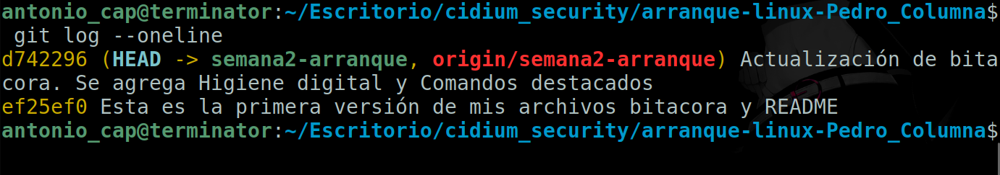

# Bitácora de arranque - Pedro Columna

**Fecha:** 19/03/2026

**Duración estimada:** 2 horas

# Pasos ejecutados

1- Primero cree la carpeta cidium_security, donde llevaré a cabo todas las prácticas relacionadas con esta bonita comunidad, para ello usé el comando mkdir de la siguiente forma

mkdir cidium_security

2- Luego con el comando cd entre a esa carpeta

cd cidium_security

3- Después cloné el repositorio del laboratorio2 arranque-linux-Pedro_Columna
con:

git clone https://github.com/pedrocolumnaalv/arranque-linux-Pedro_Columna

4- Luego con el comando ls corroboré que se haya clonado la carpeta arranque-linux-Pedro_Columna

ls

5- Tal como lo indica el ejercicio del laboratorio 2 intenté crear una rama con el siguiente comando.

git checkout -b semana2-arranque

## Problemas encontrados 

Pero me salió un mensaje de error:

fatal: no es un repositorio git (ni ningún padre en el punto de montaje /)
Parando a la frontera del sistema de archivos (GIT_DISCOVERY_ACROSS_FILESYSTEM no establecido).

## Como lo resolví

Esta falla sucedió porque no había entrado a la carpeta del repositorio, para corregirlo solo ingresé a su carpeta:

cd arranque-linux-Pedro_Columna

6- Volví a intentar crear mi rama 

git checkout -b semana2-arranque

Y me saltó el mensaje “Cambiado a nueva rama ‘semana2-arranque’”

7- Como no tenía archivo README.md lo creé con nano.

nano README.md

8- Entonces sobre el archivo coloqué mi nombre de usuario de GitHub y mi color favorito.

Nota: Para guardar el contenido apreté Ctrl + O y para salir de nano Ctrl + X

9- Del mismo modo cree el archivo bitacora.md. Que es el presente archivo.

nano bitacora.md

## Comandos destacados

Una vez acabe de hacer mis dos archivos .md utilice los siguiente comandos de Git.

git status --------------------------------------------------------------------- Nos muestra los archivos que hemos modificado, o los que agregamos, también muestra en que rama estamos para subir un cambio

git add . ---------------------------------------------------------------------- Prepara los archivos de la carpeta actual para enviarlos

git commit -m "mensaje" -------------------------------------------------------- Este comando nos ayuda a poner una descripcion de los cambios realizados.

git push origin semana2-arranque------------------------------------------------ Este comando envia los commits a la nube de GitHub

git config --global user.email "tu-correo-de-github@ejemplo.com ---------------- El comando config nos permite configurar git de forma global para vincular nuestro email

git config --global user.name "Pedro Columna" ---------------------------------- Nos permite configurar git de forma global para vincular nuestro usuario

## Problema encontrado 2

Al momento de hacer el commit me salió el siguiente error

*** Por favor cuéntame quién eres.

Ejecuta

  git config --global user.email "you@example.com"
  git config --global user.name "Tu Nombre"

para configurar la identidad por defecto de tu cuenta.
Omite --global para configurar tu identidad solo en este repositorio.

## Como lo resolví

Para solucionarlo ejecute los comandos indicados en el mensaje de error junto con mi correo electronico y mi nombre de usuario de Git, de la siguiente manera:

git config --global user.email "pe_droantonio@hotmail.com"
git config --global user.name "pedrocolumnaalv"

11- Una vez hecho pude hacer mi commit sin problemas con el siguiente comando.

git commit -m "Esta es la primera versión de mis archivos bitacora y README"

10- Hice un push para subir mis archivos a GitHub

git push origin semana2-arranque

11- Aqui Git me pidió autenticarme con mi usuario y mi token

## Resultado de git log –oneline

## Higiene digital aplicada 

MFA

    • Apliqué el segundo factor de autenticación, para ello en GitHub me dirigí a la siguiente ruta:
    • Settings > Password and authentication  > Two Factor Authentication
    • Después en mi celular descargué Authenticator para escanear el codigo QR. Una vez escaneado ingrese el número de 6 digitos en la casilla Verify Code

Token

    • Para hacer un token ingrese a esta ruta en GitHub 
    • Settings > Developer Settings > Personal Access Tokens > Tokens classic.
    • Luego  di permisos de repo, haciendo checklist en la casilla repo
    • Y por ultimo hize click al boton verde Generate Token

